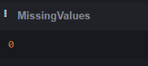

### AppleStore_Data_Analysis ✨

#### Overview :
Analysis of Apple's App Store data for extracting insights and business improvement, using SQLite and Analytical SQL Functions.
#### Tools :
SQL
#### EDA :
Examples of Exploratory Data Analysis :
- Checking Missing values :
  
  
- Finding the number of apps per genre:
  
  
#### Analysis:
We can answer questions such as :
- Does paid apps have higher ratings than free apps?
  
  
- What's the top-rated apps for each genre?
  
  

#### Insights 🔮:
- Paid apps  have better ratings 
- Apps supporting between 10 and 3 languages have better ratings 
- Finance and book apps have low ratings (new market penetration)
- Apps with a longer description have better ratings
- A new app should aim for an average rating above 3.5 
- Games and entertainement have high competition (high user demand /market saturation)

